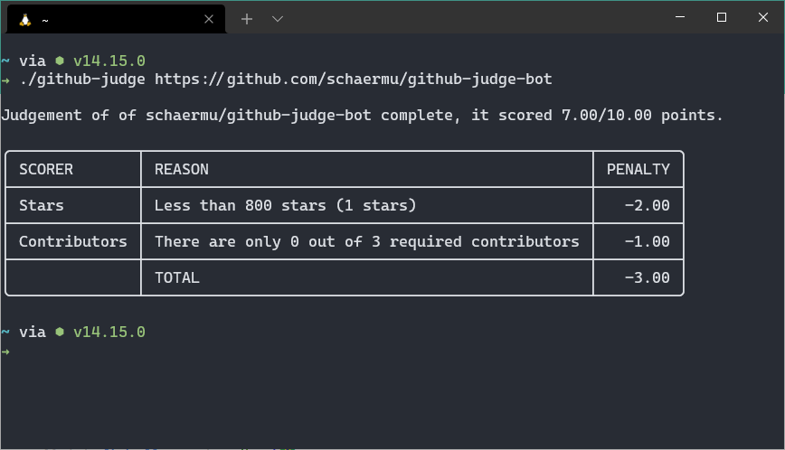
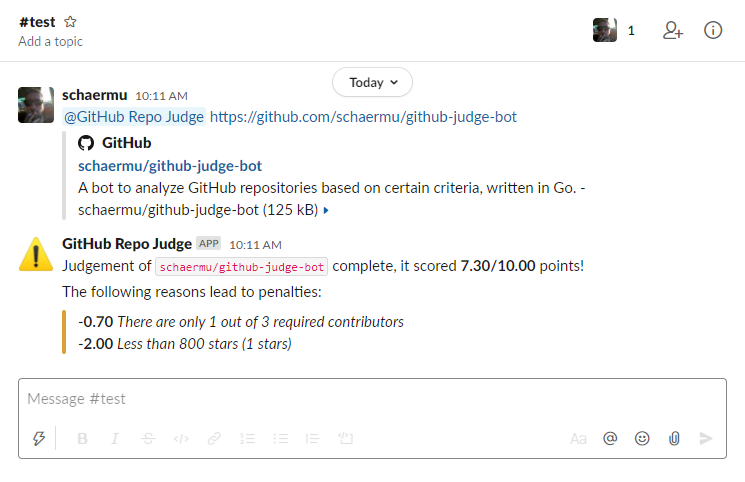

[](https://codecov.io/gh/schaermu/github-judge-bot) [](https://circleci.com/gh/schaermu/github-judge-bot) [](https://goreportcard.com/report/github.com/schaermu/github-judge-bot)
# GitHub Judge Bot - Your OpenSource evaluation buddy
Ever wondered if that new, great open-source library you just found on Github is actually maintained? Or has too many open issues compared to the closed ones? Or has too restrictive licensing?

<p align="center">🤖 <span style="font-style: italic">GitHub Judge Bot will answer those questions for you!</span> 💡</p>

This application can either be used in CLI-mode or in Bot-mode. When using it in CLI mode, you can quickly gain insights into some key metrics of a Github repository using your shell. If you want to provide this capability to your whole team, you probably want to use it in bot mode.

*DISCLAIMER:* This bot is a port of an [old node.js](https://github.com/schaermu/repolyzer-slackbot) project of mine. The Go code is probably not state-of-the-art, but this project is supposed to help me get up to speed.

# Usage - CLI

You can simply run the executable and feed it a Github URL as an argument. If you don't have a config.yaml file present in the current folder, `github-judge-bot` will just use the default config (see `config.yaml.example`).

If you run into issues with the Github API, see [this section](#github-api) of the docs.

# Usage - Bot


Running the application in bot mode requires some more steps. First of all, copy `config.yaml.example` to `config.yaml` for further customization.

## Configure Slack
1) Create a new [Slack app](https://api.slack.com/apps).
2) Copy the Signing Secret from the `App Credentials` section to the config (`slack.signing_secret`).
3) Create a new App-Level token with `connections:write` permissions.
4) Copy the App-Level token to the config (`slack.app_token`).
5) Activate Socket Mode on your app.
6) Switch to *OAuth & Permissions*
7) Add the following Bot Token Scopes to your app:
    ```
    app_mentions:read
    chat:write
    chat:write.customize
    ```
8) Switch to *Event Subscriptions*.
9) Subscribe to the following bot events:
    ```
    app_mention
    ```
10) Go back to *OAuth & Permissions* and install the bot in your workspace.
11) Copy the Bot token to the config (`slack.bot_token`)

## Running
You can either run the pre-compiled binary or you can use docker (recommended).

If you run into issues with the Github API, see [this section](#github-api) of the docs.

### Binary
Make sure your config file is in the same folder as the executable, then simply start the `github-judge` binary.

### Docker
Starting the bot using docker is simple as well:
```
docker run -v "$(pwd)"/config.yaml:/config.yaml:ro ghcr.io/schaermu/github-judge-bot:latest
```

# GitHub API

**IMPORTANT**: For unauthenticated requests (which is the default config), the rate limit allows for up to **60 requests per hour**. Unauthenticated requests are associated with the originating IP address, and not the user making requests.

If you want increase this limit (up to 5'000), you need to configure an access token:

1) Create a new [Personal Access Token](https://github.com/settings/tokens) with the `repo:public_repo` permission.
2) Copy the token to the config (`github.access_token`) and set up your username in GitHub.
